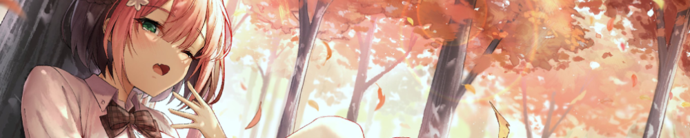

# 🌇 Sunset - frontend for osu!sunrise

  

## Description

Sunset is a frontend for the osu! private server called Sunrise. It is a part of the Sunrise project, which aims to create a fully functional osu! private server with all the features that the official server has. This project is made with TypeScript and Next.js.

## Installation 📩

1. Clone the repository
2. Install the required dependencies: `npm install`
3. Start the application: `npm run build` and `npm run start`

## Contributing 💖

If you want to contribute to the project, feel free to fork the repository and submit a pull request. We are open to any
suggestions and improvements.

## License

This project is licensed under the MIT License. See the [LICENSE](../LICENSE) file for more details.
